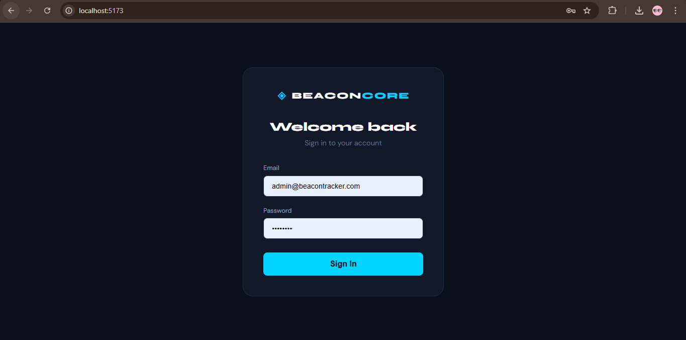
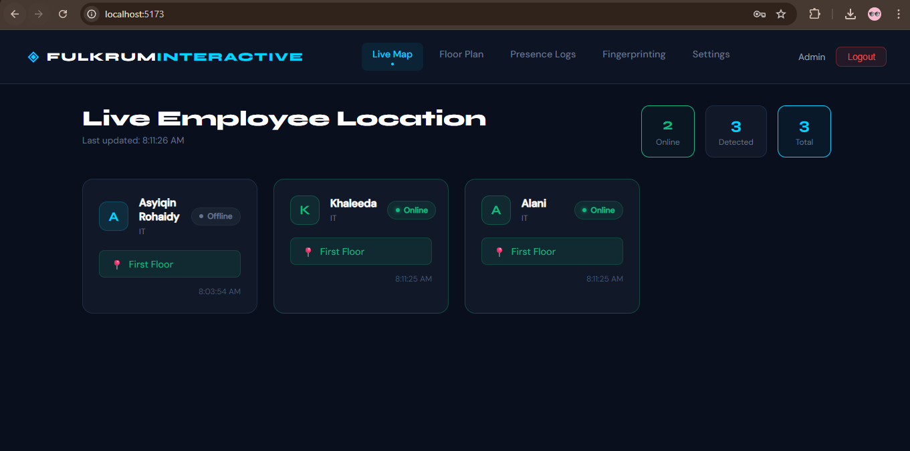
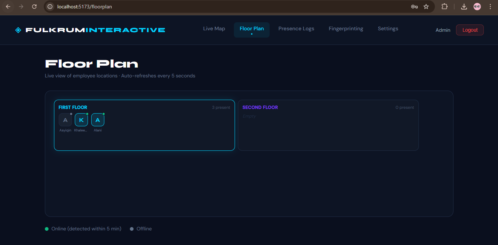
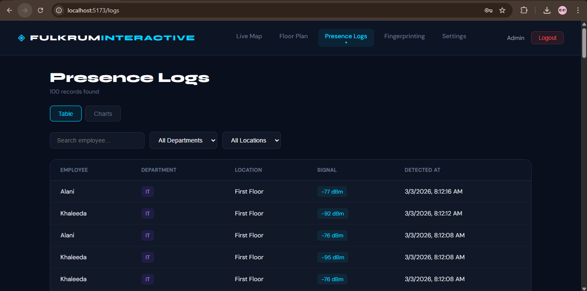
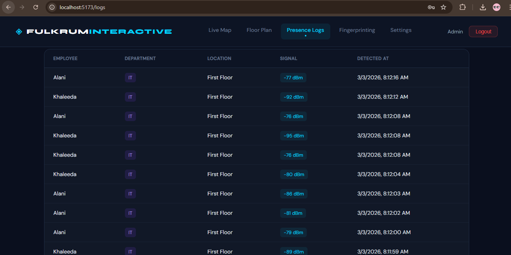
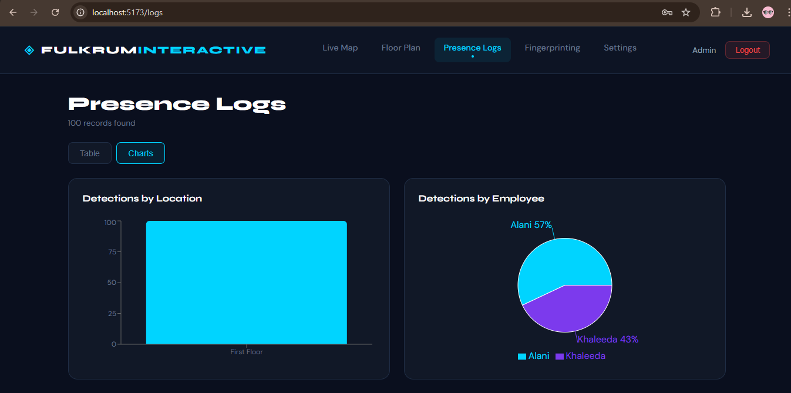
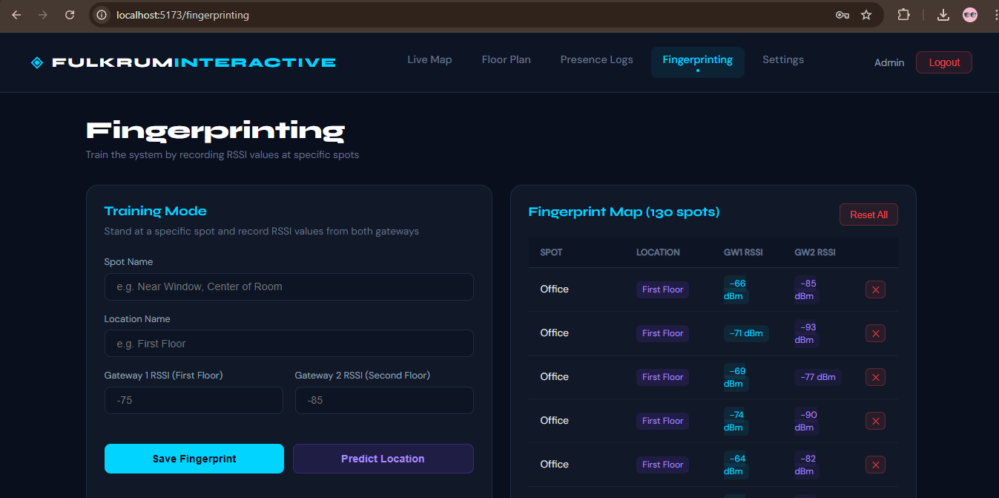
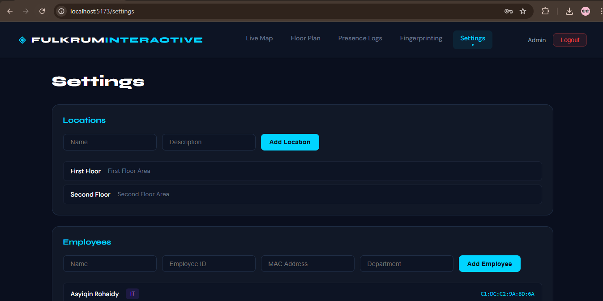
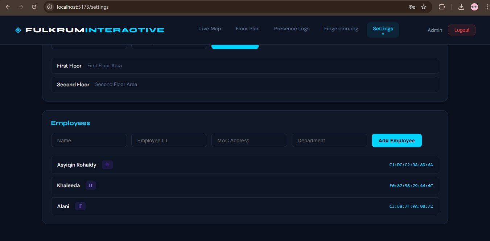
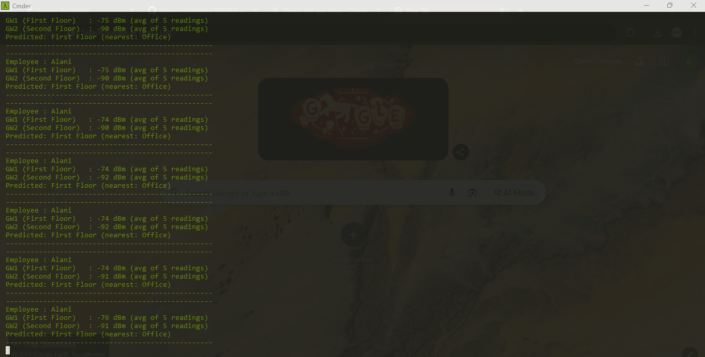

# BeaconCore — React Frontend

A real-time employee location tracking dashboard built with React and Recharts.

## Tech Stack
- **React + Vite** — Frontend framework
- **React Router** — Navigation
- **Axios** — API calls
- **Recharts** — Charts and graphs

## Pages
- **Live Map** — Employee cards with online/offline status, auto-refreshes every 5 seconds
- **Floor Plan** — Visual office map showing employees in rooms in real time
- **Presence Logs** — Full history table with search, filter, and charts
- **Settings** — Manage office locations and employees

## Installation

1. Clone the repository
```bash
git clone https://github.com/asyiqinrohaidy/beacon-dashboard.git
cd beacon-dashboard
```

2. Install dependencies
```bash
npm install
```

3. Update API base URL in `src/api/axios.js`
```js
baseURL: 'http://localhost:8000/api'
```

4. Start the development server
```bash
npm run dev
```

5. Open `http://localhost:5173`

## Backend
Laravel API: [beacon-tracker](https://github.com/asyiqinrohaidy/beacon-tracker)

## Screenshots

### Login Page
> Secure authentication page for system access.


### Live Map Page
> Real-time employee location tracking with online/offline status indicators.


### Floor Plan Page
> Visual office map showing employee presence in each room in real time.


### Presence Logs Page
> Full detection history with search and filter by employee, department and location.


### Presence Logs Page


### Presence Logs Charts
> Visual analytics showing detections by location and employee using bar and pie charts.


### Fingerprinting Page
> Training mode for collecting RSSI fingerprints and live location prediction using Weighted KNN algorithm.


### Settings 
> Manage office locations and registered employees with beacon MAC addresses.


### Settings


### Readings
> Terminal showing real-time RSSI averaging from both gateways with predicted location.

